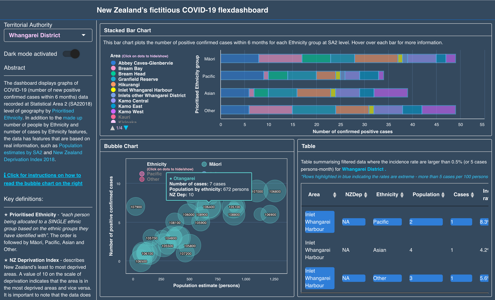

# NZ's fictitious COVID-19 FLEXDASHBOARD

## About the data
The data (*number of confirmed positive COVID-19 cases*) used in this dashboard was generated randomly using a simple mathematics algorithm and hence is completely fictitious and has nothing with to do with the true COVID-19 statistics in New Zealand. Information about population estimates, prioritised ethnicity and NZ Deprivation Index recorded at SA2 geographical level are not fabricated. 

## Sources

* [2018 census Population estimates by regions and prioritised ethnicity](https://www.stats.govt.nz/information-releases/statistical-area-1-dataset-for-2018-census-updated-march-2020)

* [NZ Deprivation Index 2018](https://www.otago.ac.nz/wellington/departments/publichealth/research/hirp/otago020194.html)

## Snapshot

